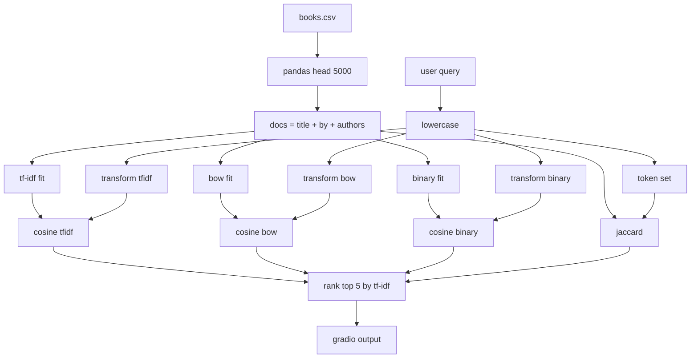
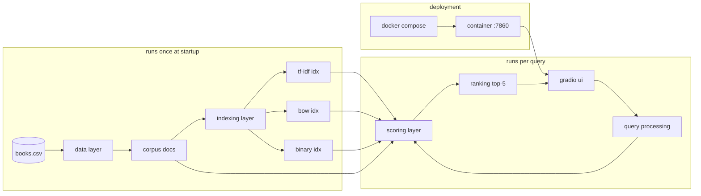
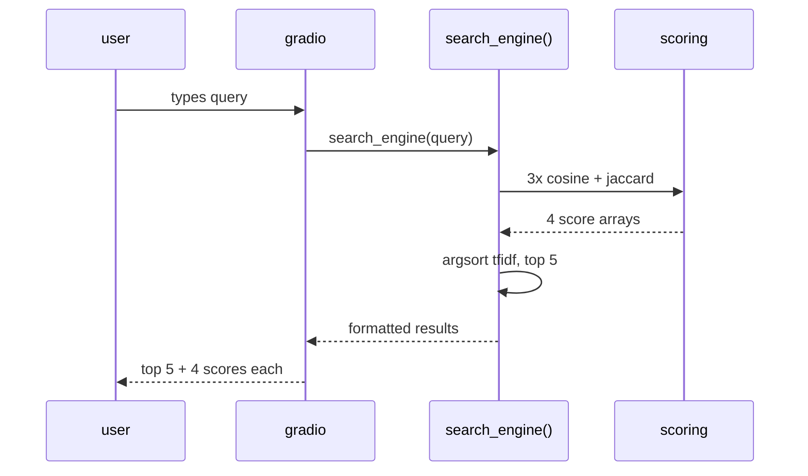

# nlp assignment 3 — book search engine

a working search engine over the **goodreads-books** dataset, comparing 4 classical nlp ranking methods side by side. fully dockerized — one command to run.

> course: natural language processing &nbsp;·&nbsp; assignment: 3 &nbsp;·&nbsp; team size: 5

---

## team members

| # | name | roll no |
|---|------|---------|
| 1 | muhammad umar | 19094-MU216 |
| 2 | _add name_ | _roll_ |
| 3 | _add name_ | _roll_ |
| 4 | _add name_ | _roll_ |
| 5 | _add name_ | _roll_ |

---

## quick start (docker)

the assignment requires the project to run with no setup. so:

```bash
git clone https://github.com/19094-MU216-MUHAMMADUMAR/goodreads-search-engine.git
cd goodreads-search-engine
docker compose up
```

then open **http://localhost:7860** in your browser. that's it.

to stop: `Ctrl+C`, then `docker compose down`.

---

## the 4 algorithms

assignment required tf-idf + 3 more. we picked 3 that come from genuinely different retrieval families so the comparison is meaningful:

| # | method | family | similarity |
|---|--------|--------|------------|
| 1 | **tf-idf** | weighted vector space | cosine |
| 2 | **bag of words** | frequency vector space | cosine |
| 3 | **binary / probabilistic** | boolean | cosine |
| 4 | **jaccard** | set-based | intersection / union |

---

## dataset

[goodreads-books on kaggle](https://www.kaggle.com/datasets/jealousleopard/goodreadsbooks). already in the repo as `books.csv`. we use the first 5000 rows, and the search field is `title + " by " + authors`.

---

## data flow algorithm

step-by-step of what happens to a query end to end:

```
INPUT : raw user query Q
OUTPUT: top-5 books with similarity scores from all 4 algorithms

1. load books.csv (head 5000), build docs = title + " by " + authors
2. fit 3 vectorizers ONCE at startup: tf-idf, bow, binary
3. on query: lowercase Q, transform into all 3 vector spaces
4. compute similarities:
     - cosine for tf-idf, bow, binary
     - jaccard (set-based) for the 4th
5. argsort tf-idf scores desc, take top 5
6. format output with all 4 scores per book, return to gradio
```



---

## architecture algorithm

system-level view — what runs once vs per query:

```
LAYER 1  data layer        books.csv -> pandas -> docs list
LAYER 2  indexing  (once)  tf-idf / bow / binary indexes
LAYER 3  query processing  lowercase + tokenize + transform
LAYER 4  scoring           cosine x3 + jaccard
LAYER 5  ranking           argsort tf-idf, top-k = 5
LAYER 6  presentation      gradio textbox in / textbox out
LAYER 7  deployment        docker + docker compose, port 7860
```



### per-query sequence



---

## file structure

```
goodreads-search-engine/
├── app.py                  # main app (run by docker)
├── NLP_Assignment_3.ipynb  # original colab notebook
├── books.csv               # dataset
├── requirements.txt
├── Dockerfile
├── docker-compose.yml
├── .dockerignore
├── .gitignore
└── README.md
```

---

## sample queries

- `harry potter` — tf-idf and bow agree, jaccard slightly lower because of the "by author" tokens
- `tolkien` — author-only query, all 4 still surface lord of the rings
- `the hobbit` — short title, binary and jaccard end up almost identical
- `dan brown` — nice example of tf-idf down-weighting the common token "brown"

---

## observations

- **tf-idf** gave the most intuitive ranking overall — idf kills off common words like "the".
- **bow** tracks tf-idf closely on short queries but degrades when stopwords slip in.
- **binary** is surprisingly close to bow because book titles are short, so term frequency barely matters.
- **jaccard** is the strictest — it punishes the query for not matching the *whole* doc, so shorter titles get boosted.

---

## limitations / future work

- only 5000 rows loaded for demo speed (sparse matrices would scale fine to the full set)
- no stemming/lemmatization — `book` and `books` are different tokens
- no spell correction
- ranking is driven by tf-idf only; a fairer demo would let the user pick the ranker
- bm25 would be a natural 5th algorithm to add

---

## tech

python 3.11 · pandas · numpy · scikit-learn · gradio 3.50.2 · docker · docker compose

---

*nlp course — assignment 3*
