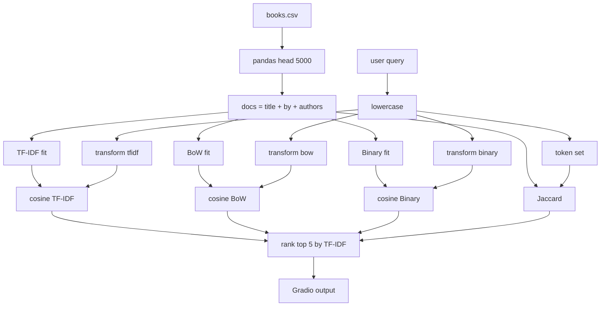
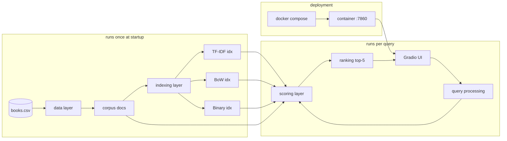
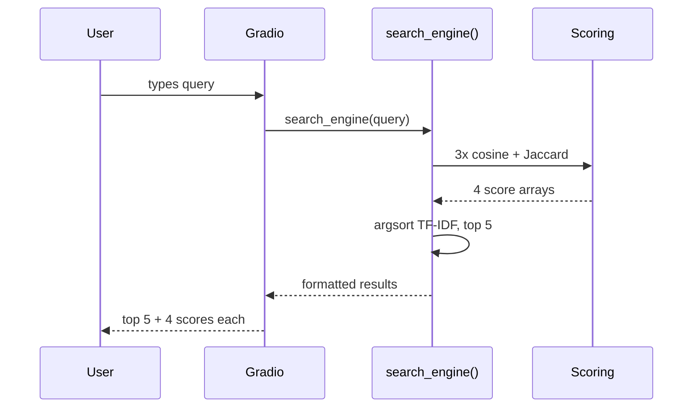

# Goodreads Book Search Engine

A small search engine over the Goodreads-Books dataset built for our NLP course (Assignment 3). It compares four classical information-retrieval methods side by side so you can see how each one ranks the same query differently.

The whole thing runs in Docker, so a single command brings up the web UI on `http://localhost:7860`.

---

## Group Members

| # | Name | Roll No |
|---|------|---------|
| 1 | Muhammad Hammad Ihsan | F23607006 |
| 2 | Mohsin Pervaiz | F23607009 |
| 3 | Osama Zubair | F23607026 |
| 4 | Sohail Aslam | F23607054 |
| 5 | Sameer Rizwan | F23607050 |

---

## Running it

```bash
git clone https://github.com/hammad8622/goodreads-search-engine.git
cd goodreads-search-engine
docker compose up
```

Then open **http://localhost:7860**.

To stop it: `Ctrl+C`, then `docker compose down`.

If you'd rather run it without Docker:

```bash
pip install -r requirements.txt
python app.py
```

---

## The four algorithms

The assignment required TF-IDF plus three more. We picked methods from genuinely different retrieval families so the comparison would actually show something:

| # | Method | Family | Similarity |
|---|--------|--------|------------|
| 1 | TF-IDF | weighted vector space | cosine |
| 2 | Bag of Words | frequency vector space | cosine |
| 3 | Binary / Probabilistic | boolean vector space | cosine |
| 4 | Jaccard | set-based | intersection / union |

---

## Dataset

[Goodreads-Books on Kaggle](https://www.kaggle.com/datasets/jealousleopard/goodreadsbooks). The CSV is committed as `books.csv`. We load the first 5000 rows and build the searchable field as `title + " by " + authors`, so a query can match either the book name or the author.

---

## Data flow algorithm

Step-by-step of what happens to a query from the moment it's typed until results appear:

```
INPUT : raw user query Q
OUTPUT: top-5 books with similarity scores from all 4 algorithms

1. Load books.csv (head 5000) and build docs = title + " by " + authors
2. Fit 3 vectorizers ONCE at startup: TF-IDF, BoW, Binary
3. On each query, lowercase Q and transform it into all 3 vector spaces
4. Compute similarities:
     - cosine for TF-IDF, BoW, Binary
     - Jaccard (set-based) for the 4th
5. Argsort the TF-IDF scores descending and take the top 5
6. Format the output (each book + all 4 scores) and return to Gradio
```



---

## Architecture algorithm

A system-level view: which components exist, what runs once, and what runs on every query.

```
Layer 1  Data           books.csv -> pandas -> docs list
Layer 2  Indexing (1x)  TF-IDF / BoW / Binary indexes
Layer 3  Query proc.    lowercase + tokenize + transform
Layer 4  Scoring        cosine x3 + Jaccard
Layer 5  Ranking        argsort TF-IDF, top-k = 5
Layer 6  Presentation   Gradio textbox in / textbox out
Layer 7  Deployment     Docker + Compose, port 7860
```



### Per-query sequence



---

## Repo layout

```
goodreads-search-engine/
├── app.py                  # main app entry point
├── NLP_Assignment_3.ipynb  # original Colab notebook
├── books.csv               # dataset
├── requirements.txt
├── Dockerfile
├── docker-compose.yml
├── .dockerignore
├── .gitignore
└── README.md
```

---

## Sample queries to try

- `harry potter` — TF-IDF and BoW agree closely; Jaccard drops a bit because of the "by author" tokens.
- `tolkien` — author-only query; all four still surface The Lord of the Rings.
- `the hobbit` — short title, so Binary and Jaccard end up nearly identical.
- `dan brown` — a good example of TF-IDF down-weighting the common token "brown".

---

## What we observed

- **TF-IDF** gave the most intuitive ranking overall, mostly because IDF kills off common words like "the".
- **BoW** tracks TF-IDF closely on short queries but starts losing quality whenever a stopword slips in.
- **Binary** is surprisingly close to BoW here because book titles are short — term frequency barely matters in a 4-word title.
- **Jaccard** is the strictest. It penalises the query for not matching the *whole* document, so shorter titles get an unfair boost.

---

## Limitations

- Only 5000 rows are loaded for demo speed (the sparse representation would scale to the full set fine).
- No stemming or lemmatization — `book` and `books` are treated as different tokens.
- No spelling correction.
- The final ordering is driven by TF-IDF only; a fairer demo would let the user pick the ranker.
- BM25 would be an obvious 5th algorithm to add later.

---

## Tech

Python 3.11 · pandas · NumPy · scikit-learn · Gradio 3.50.2 · Docker · Docker Compose
