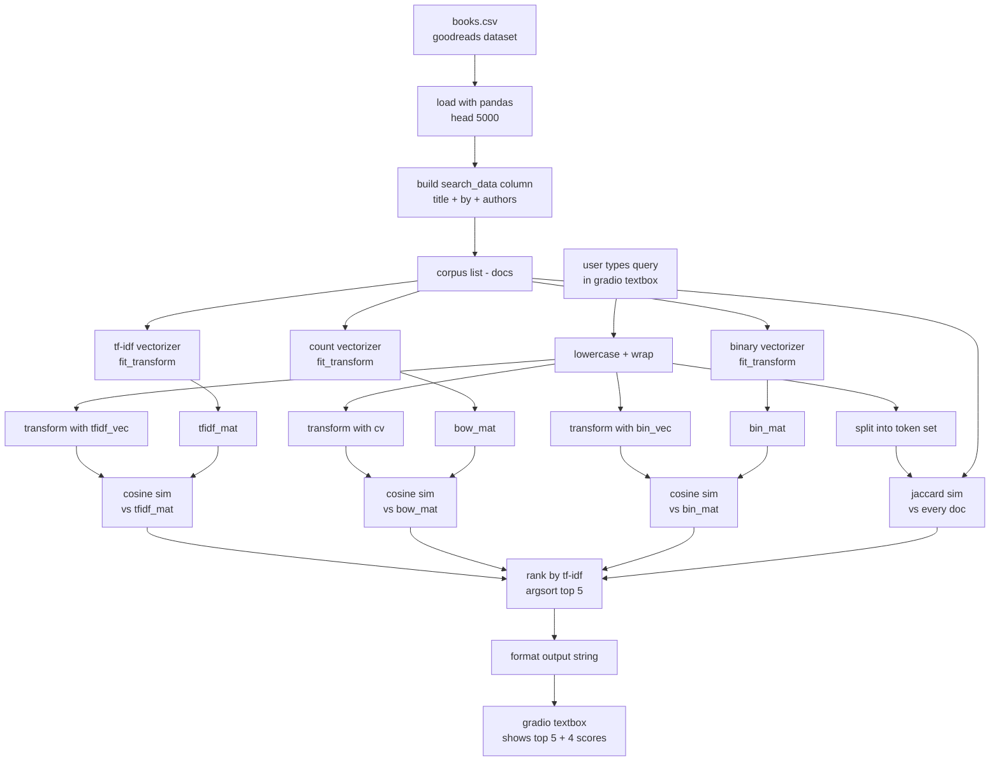
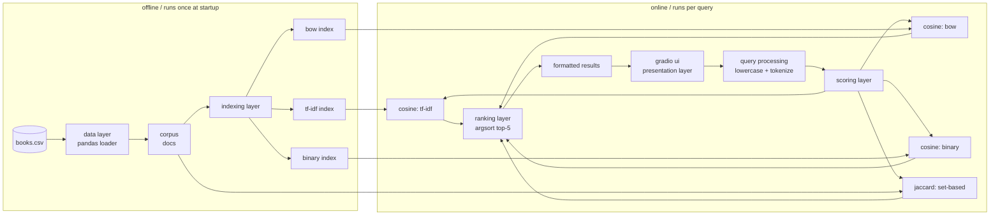
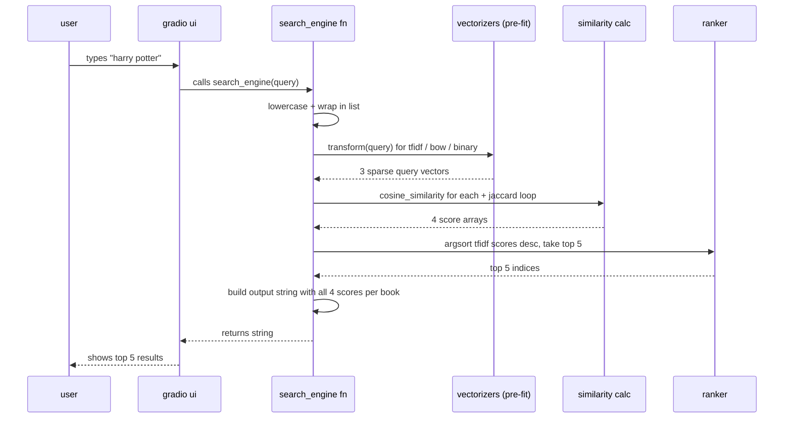

# nlp assignment 3 — book search engine

a small search engine built for our nlp course (assignment 3). the idea was simple: take a dataset, build an actual *working* search engine on top of it, and compare a few different classical nlp ranking methods side by side instead of just picking one.

we went with the **goodreads-books** dataset and built a gradio demo so anyone can type a query and immediately see how the 4 algorithms rank the same results differently.

> course: natural language processing  
> assignment: 3  
> team size: 5  
> required: tf-idf + 3 other approaches + working demo  

---

## team members

| # | name | roll no |
|---|------|---------|
| 1 | muhammad umar | 19094-MU216 |
| 2 | _add name_ | _roll_ |
| 3 | _add name_ | _roll_ |
| 4 | _add name_ | _roll_ |
| 5 | _add name_ | _roll_ |

(replace the placeholders with the rest of the group, i didn't want to put names without asking)

---

## what's inside

- `NLP_Assignment_3.ipynb` — the actual notebook with all the code
- `books.csv` — the goodreads dataset (download separately, see below)
- `README.md` — this file

---

## the 4 algorithms we used

we needed tf-idf + 3 more, so we went with:

1. **tf-idf** (term frequency × inverse document frequency) + cosine similarity
2. **bag of words (bow)** — raw term counts + cosine similarity
3. **binary / probabilistic model** — presence/absence of terms + cosine similarity
4. **jaccard similarity** — set-based intersection over union

the reason we picked these is that they cover three pretty different "families" of retrieval:
- weighted vector space (tf-idf)
- frequency vector space (bow)
- boolean/probabilistic (binary)
- set-based (jaccard)

so the comparison is actually meaningful instead of being 4 variations of the same thing.

---

## dataset

we used the **goodreads-books** dataset from kaggle:  
https://www.kaggle.com/datasets/jealousleopard/goodreadsbooks

we only loaded the first **5000 rows** to keep it fast in colab. the search field is built by joining the book title and the author together:

```
search_data = title + " by " + authors
```

so a query like `"harry potter"` matches both the title and `"j.k. rowling"` style author queries.

---

## data flow algorithm

this is the step-by-step pipeline of *how a query becomes a ranked list of books*. basically what happens to the data from the moment the user types something until the results show up on screen.

### the algorithm (in plain words)

```
INPUT : a raw user query string Q
OUTPUT: top-5 ranked books with similarity scores from 4 algorithms

STEP 1: load dataset
        - read books.csv (first 5000 rows, skip bad lines)
        - drop unusable rows / cast to string

STEP 2: build the document corpus
        - for each row, build: doc = title + " by " + authors
        - store in list `docs`

STEP 3: pre-fit vectorizers (done ONCE at startup, not per query)
        - tf-idf vectorizer  -> tfidf_mat
        - count vectorizer   -> bow_mat
        - binary vectorizer  -> bin_mat

STEP 4: receive query Q from gradio textbox
        - lowercase it
        - wrap it in a list

STEP 5: transform query into the SAME vector spaces as the corpus
        - q_tfidf = tfidf_vec.transform(Q)
        - q_bow   = cv.transform(Q)
        - q_bin   = bin_vec.transform(Q)

STEP 6: compute similarity for each algorithm
        - res1 = cosine(q_tfidf, tfidf_mat)
        - res2 = cosine(q_bow,   bow_mat)
        - res3 = cosine(q_bin,   bin_mat)
        - res4 = jaccard(set(Q), set(doc))  for each doc

STEP 7: rank
        - sort by tf-idf descending
        - take top 5 indices

STEP 8: format output
        - for each of the top 5: print book + all 4 scores

STEP 9: return the formatted string back to gradio
```

### data flow diagram



---

## architecture algorithm

this is the *system level* view — what components exist, how they're wired together, what runs once vs what runs on every query. data flow = "what happens to the data". architecture = "what are the parts of the system".

### the algorithm (component level)

```
COMPONENT 1: data layer
    - source : books.csv
    - loader : pandas (with on_bad_lines='skip')
    - shape  : 5000 × N, only title + authors used
    - output : list of strings -> docs

COMPONENT 2: indexing layer  (offline, runs ONCE)
    - tf-idf index    (sklearn TfidfVectorizer)
    - bow index       (sklearn CountVectorizer)
    - binary index    (sklearn CountVectorizer, binary=True)
    - jaccard "index" (none — computed on the fly from docs)

COMPONENT 3: query processing layer  (online, per query)
    - normalize  : lowercase
    - tokenize   : whitespace split (for jaccard)
    - vectorize  : .transform() into each fitted space

COMPONENT 4: scoring layer  (online, per query)
    - cosine similarity for tf-idf / bow / binary
    - set-based jaccard for the 4th method

COMPONENT 5: ranking layer
    - argsort the tf-idf scores descending
    - select top-k (k = 5)
    - look up the same indices in the other 3 score arrays
      (so the user sees how each algo rated the SAME 5 books)

COMPONENT 6: presentation layer
    - gradio Interface
        inputs : single textbox
        outputs: textbox (multiline)
    - launch with share=True for a public colab url
```

### architecture diagram



### sequence of what happens per query



---

## how to run

### option 1 — google colab (easiest, this is what we used)

1. open `NLP_Assignment_3.ipynb` in colab
2. upload `books.csv` to `/content/` (or change the path in the notebook)
3. run all cells
4. click the public `gradio.live` link that gets printed
5. type a query, get results

### option 2 — local

```bash
pip install gradio==3.50.2 pandas scikit-learn numpy
jupyter notebook NLP_Assignment_3.ipynb
```

then open `http://127.0.0.1:7860` in a browser once gradio launches.

---

## sample queries to try

- `harry potter` — tf-idf and bow agree strongly, jaccard a bit lower because of the "by author" tokens
- `tolkien` — author-only query, all 4 still rank lord of the rings high
- `the hobbit` — short title, binary and jaccard end up very similar
- `dan brown` — good for showing how tf-idf down-weights the common token "brown"

watching how the 4 scores diverge for the same book is honestly the most interesting part of the whole project.

---

## things we noticed (small write-up of results)

- **tf-idf** consistently gave the most "intuitive" ranking, especially for queries with common words like "the", because idf kills them off.
- **bow** behaves very similarly to tf-idf for short queries (which most book searches are) but starts losing quality when the query has any common english word.
- **binary** is surprisingly competitive on this dataset because titles are short — there's no real benefit in counting how many times a word appears in a 5-word title.
- **jaccard** is the strictest. it punishes the query for not matching the *whole* document, so it tends to rank shorter titles higher. good for exact-match feel, bad for partial queries.

---

## limitations / what we'd improve next

- only 5000 rows loaded — full dataset would need a sparse-matrix friendly approach (we already use sparse, so it'd actually scale fine, we just kept it small for the demo)
- no stemming / lemmatization — "books" and "book" are treated as different tokens
- ranking is currently sorted only by tf-idf; a fairer demo would let the user pick which algorithm drives the ranking
- no spell correction — typing "hary poter" returns nothing useful
- could add a fifth algorithm (bm25) as a stretch goal — it's basically the "industry standard" upgrade over tf-idf

---

## tech used

- python 3
- pandas, numpy
- scikit-learn (`TfidfVectorizer`, `CountVectorizer`, `cosine_similarity`)
- gradio 3.50.2 (for the web demo)
- google colab (for hosting the share link during the demo)

---

## file structure

```
goodreads-search-engine/
├── NLP_Assignment_3.ipynb
├── books.csv               # not pushed to git, download from kaggle
├── README.md
└── .gitignore
```

---

*submitted as part of the nlp course, assignment 3.*
